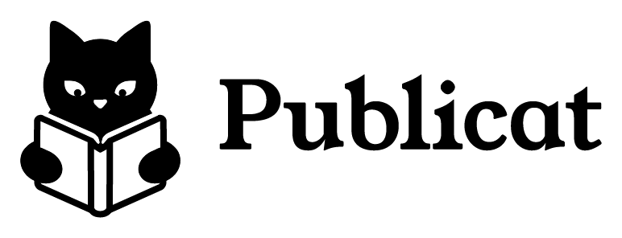

  

## Overview

Publicat is a french platform where users can write and share their stories, similar to [wattpad](https://www.wattpad.com/) and [AO3](https://archiveofourown.org/).

This was my final year project when I studied PHP, and this repository exists solely to share its contents. Publicat is not a project I plan to continue, although I had a lot of fun doing it. I do not plan to make any new changes or accept pull requests.

You are completely free to fork it, and use all the content found in this archive (just give me a little credit if you use the logos please ☺️).

## License
Publicat is under the [Mozilla Public License 2.0](https://github.com/alkanife/publicat/blob/main/LICENSE). The router is under the [MIT License](https://github.com/bramus/router/blob/master/LICENSE).